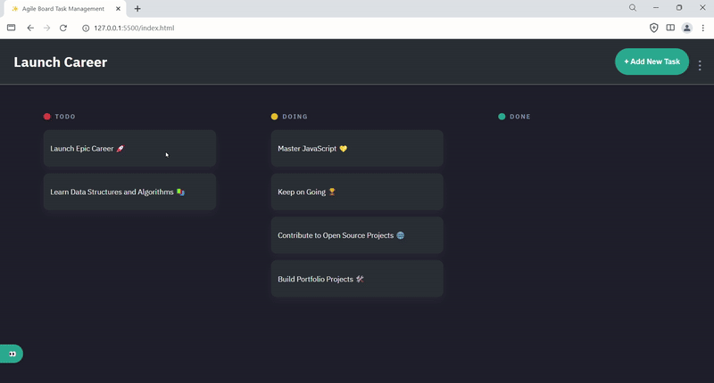
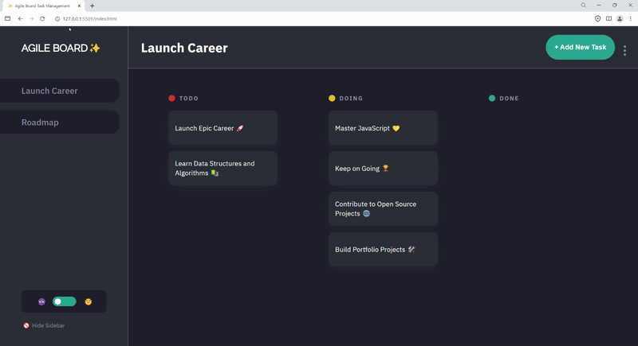

### [JSL11] Agile Board - Kanban Task Management App

# Noxolo Ngcobo 

### Overview
 In this project, we are tasked with tackling the provided user stories to both identify and fix bugs in the code, as well as to develop our own functions to extend the application's capabilities. Key assignments include importing utility functions, initializing data, and diving into debugging tasks such as setting up data correctly in local storage, dynamically displaying boards and tasks, and enhancing user interactions.

Additionally, we will enhance the application by crafting code to meet specific functionalities outlined in the user stories, like managing task details and their lifecycle, toggling theme customization, and ensuring the persistence of data through local storage. This blend of debugging and creative coding forces us to apply our critical thinking and problem-solving skills in a hands-on manner, equipping us for the intricacies of real-world software development scenarios.
### Reflections

#### Areas of Mastery

- **Working import and export functions**:  I feel confident creating and using export funtion and importing them in other files.
- **Debugging**: Still a bit tricky to work on another persons code base but it  was a huge learning curve .
- **Event listeners and handlers**: I was able to use eventlisteners effectively on the buttons  and task modals.
- **Change state of an element**: Used dynamic javascript to implement change of theme from darkMode/light mode.
- **Use of local storgae**: Used local storage to store, track and mantain tasks.
- **Use of function**:  used functions and callback functions to make code modular

#### Challenges Faced

- **event listener for the cancel , save and delete button**: the task modal buttons some how were sharing the event listener cause actions
  done in one task caused other tasks to be duplicated with same data or deleted involuntarily.

#### Areas for Improvement

- **Advanced js method**: Leaarning more js methods will improve my coding and problem solving skills
- **Code Optimization**:  Code refactoring
- **Debugging**- Practuse more debubbing with code bases that already exist.

#### Overall Learning Experience

  This was a great challenge , I learnt new methods of debbuging and problem solving.

#### Resources used & links to slides, video presentation

##### Resources:
- **used AI to assist with bugs and debug my code**-copilot/Meta Ai
- **Google**-Used stackoverflow and MDN

##### Slides, deployed app and Video Presentation
- **Video presentation**- https://www.loom.com/share/ebd4d1ddd14e4e2ea54f4c5611075e22?sid=c5f762aa-feb6-46b5-bf80-03383c3098bc

# Agile Board Project Feature List

In this Agile Board Project Feature List, you're introduced to a comprehensive suite of functionalities designed to enrich your Kanban Task Management App. 

As you embark on implementing these features, remember the value of tackling the project one small task at a time. This approach not only makes the process more manageable but also ensures that you can focus on the quality of each feature, leading to a more robust and user-friendly application. Your journey through this project is a great opportunity to apply and hone your skills, so take it step by step and enjoy the learning experience.

# Task Interaction and Detail Management
- **Clicking an Individual Task for Details**: As a user, I want to click on an individual task so that I can view its details and make edits if necessary.
- **Opening the Task Edit Modal**: As a user, I want to open a modal window when adding or editing tasks to easily input task information.
- **Updating the Task Title**: As a user, I want to update the task title within the modal to change how it’s displayed on the board.
- **Updating the Task Description**: As a user, I want to update the task description within the modal so I can better describe what needs to be done.
- **Updating the Task Status**: As a user, I want to update the current status of a task (todo, doing, done) to track its progress.
- **Saving Task Changes**: As a user, I want to save the changes I make to a task so that the updated details are stored and displayed.
- **Updating the UI with Task Changes**: As a user, I expect the changes I make to a task to be reflected immediately on the UI without needing to refresh.
- **Deleting a Task from the Edit Modal**: As a user, I want the ability to delete a task directly from the edit modal if it’s no longer needed.
- **Canceling Edits Without Saving**: As a user, I want to be able to cancel my edits and close the modal without saving to avoid accidental changes.
- **Editing Task Details**: As a user, I want to edit the details of an existing task to correct or update information as needed.
- **Easy Navigation Between Task Statuses**: As a user, I want to easily move tasks between statuses (todo, doing, done) to reflect their current progress.
- **Viewing Task Details**: As a user, I want to view detailed information about a task to understand its scope and requirements fully.

# Task Deletion and Confirmation Mechanisms
- **Clicking "Delete Task" Button**: As a user, I want to click a "Delete Task" button within the task edit modal so I can remove tasks that are no longer necessary.
- **Immediate UI Update on Task Deletion**: As a user, I expect a task to disappear from the UI immediately after I confirm its deletion to reflect the current state of my task list.

# Theme Customization
- **Switching to Dark Mode**: As a user, I want to switch to dark mode so that I can reduce eye strain in low-light conditions.
- **Switching Back to Light Mode**: As a user, I want to switch back to light mode from dark mode to better suit bright environments and see the logo update accordingly.

# Managing the Sidebar
- **Hiding the Side Bar for More Workspace**: As a user, I want the ability to hide the side bar to gain more workspace.
- **Opening the Side Bar for Navigation and Options**: As a user, I want to easily open the side bar to navigate between boards.

# Task Lifecycle Management
- **Clicking "Add New Task" to Start Adding a Task**: As a user, I want to click the "Add New Task" button so I can begin the process of adding a new task to my board.
- **Modal Opens for New Task Input**: As a user, I expect the modal to open when I click "Add New Task" to provide me with a form to input the task's details.
- **Adding a Title to the New Task**: As a user, I want to be able to add a title to my new task so I can clearly identify it on the board.
- **Adding a Description to the New Task**: As a user, I want to be able to add a description to my new task to provide more details about what needs to be done.
- **Selecting a Status for the New Task**: As a user, I want to select a status for my new task (e.g., Todo, Doing, Done) to categorize it based on its progress.
- **Creating the New Task**: As a user, I want to click a "Create Task" button in the modal to save the new task to the board.
- **New Task Appears in UI Under Correct Status**: As a user, I expect the new task to appear in the UI under the correct status column immediately after creation.
- **Viewing New Task Details**: As a user, I want to view detailed information about the New Task to understand its scope and requirements fully.
- **Editing New Task Details**: As a user, I want to edit the details of the New Task to correct or update information as needed.

# Local Storage and Data Persistence
- **Saving New Tasks in localStorage**: As a user, I want my newly created tasks to be saved in localStorage so that my tasks persist even when I close or refresh the browser.
- **Reflecting Task Updates in localStorage**: As a user, I expect tasks that I update to have their changes reflected in localStorage so that any modifications are not lost.
- **Removing Deleted Tasks from localStorage**: As a user, I want tasks that I delete to be removed from localStorage so that my task list remains accurate and up-to-date.
